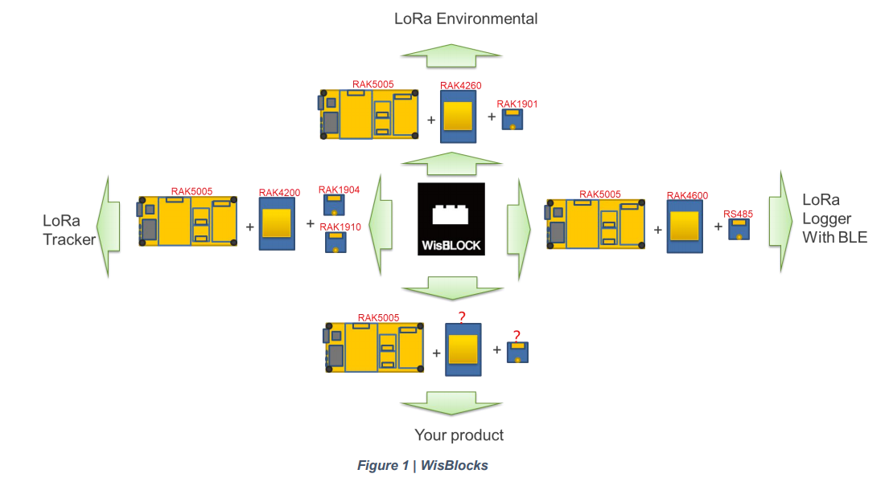
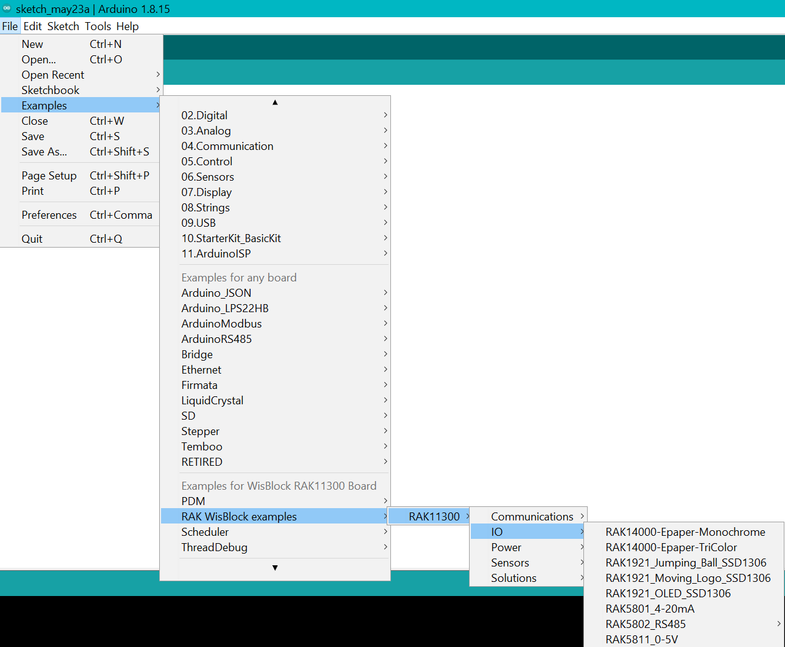

  

# Arduino Core for WisBlock Core RAK11300 modules

This repository contains the Arduino BSP for WisBlock Core modules:
- [RAK11300](https://www.rakwireless.com)

## What is WisBlock?
WisBlock is an amazing product built by the RAK company for IoT industry. It can build circuits like clicking blocks together to quickly to realize your idea. Checkout [Overview](#overview) for information or visit our [documentation center](https://docs.rakwireless.com/Product-Categories/WisBlock/)     

**RAKwireless invests time and resources providing this open source code, please support RAKwireless and open-source hardware by purchasing products from [RAKwireless](https://rakwireless.com)!**

**_For support and questions about RAKwireless products please visit our [forum](https://forum.rakwireless.com/)    
For examples and quick start tutorial please visit our [Github Repo](https://github.com/RAKWireless/Wisblock)    
For additional information about RAK products please visit our [Documentation Center](https://docs.rakwireless.com)    
To buy WisBlock modules please visit our [online store](https://store.rakwireless.com/)_**

----
## Content
- [Overview](#overview)     
  - [Description](#description)     
  - [Key Features](#key-features)     
  - [WisBlock Highlights](#wisblock-highlights)     

- [BSP Installation](#bsp-installation)    
  - [Stable Version](#stable-version)     
  - [Examples and Tutorials](#examples-and-tutorials)     
  - [Configuration](#configuration)     
----

## Overview

### Description

**WisBlock** is a modular system that makes it easy to implement a low power wide area network (LPWAN) into your IoT solution.
WisBlock is going with your solution from rapid prototyping to mass production without the need to create new hardware modules for each step.

- In the development phase, WisBlock modularity allows you to test different microcontrollers, sensors, communication technology, IO options by changing modules with the simple plug-in modules.
- WisBlock industrial-grade modules can be used in mass production without the need to redesign the prototypes.
- Even once deployed, devices can be modified or repaired with minimal waste and effort

### Key Features

**Click. Code. Connect.**

WisBlock is created with 4 modular blocks.
1. **WisBlock Base** is the baseboard that connects everything.
2. **WisBlock Core** is the computation and communication module
3. **WisBlock Sensor** is a selection of sensor and input modules
4. **WisBlock IO** extends the output and communication possibilities of the WisBlock Core

### WisBlock Highlights

- With the use of a compact connector, this makes its size exceptionally small. A WisBlock Base board, which is the base carrier, is only **30mm by 60mm** in size.
- Using an industrial rated connector, it enables you to use the same modules from rapid prototyping to testing to final product.  
- WisBlock is not only modular on the hardware base but with ready to use software blocks it is simple to create an application to match your solution requirements.

#### WisBlock Base

- WisBlock Base is the **carrier** for all WisBlock modules.
- It contains the power supply for all modules, **USB/5V connector**, **battery charger**, **solar charger**, **status LED**, and **reset button**.
- One WisBlock Base can hold one microcontroller module (WisBlock Core), one IO module (WisBlock IO), and up to 4 sensor modules (WisBlock Sensor).application to match your solution requirements.

#### WisBlock Core

- WisBlock Core is the **data processing center** of WisBlock.
- Some WisBlock Core modules also offer LoRa®/LoRaWan® communication and additional communication means like Bluetooth, Bluetooth Low Energy, or Wi-Fi.

#### WisBlock Sensor

- WisBlock Sensor is the **data acquisition module** of WisBlock.
- It includes analog, digital, and environmental as well as location acquisition sensors.

#### WisBlock IO

- WisBlock IO modules **extend the input and output possibilities** of WisBlock.
- Options include cellular, displays, LEDs, button interfaces, and additional USB and GPIO ports as well as Wi-Fi.

  

## BSP Installation

### Stable Version

----
# ⚠️ WARNING    
_**If you are using Windows 10**_.    
Do _**NOT**_ install the Arduino IDE from the Microsoft App Store. Please install the original Arduino IDE from the [Arduino official website](https://www.arduino.cc/en/Main/Software)!. The Arduino app from the Microsoft App Store has problems to use third party Board Support Packages.
:::

----

#### (1) [Download and install the Arduino IDE](https://www.arduino.cc/en/Main/Software) (At least v1.6.12)
#### (2) Follow [this guide](https://github.com/RAKWireless/RAKwireless-Arduino-BSP-Index) to install the required Board Support Package (BSP)    
----
### Examples and Tutorials
After you selected a RAK board you can see examples for all WisBlock modules

     

For more information about the examples and tutorials visit our [Github WisBlock repo](https://github.com/RAKWireless/WisBlock)    

-----
# Credits

This BSP is based on [Arduino Core for mbed enabled devices](https://github.com/arduino/ArduinoCore-mbed).    
